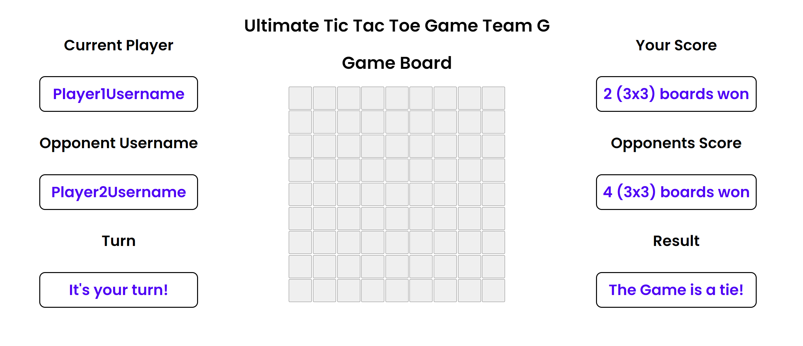
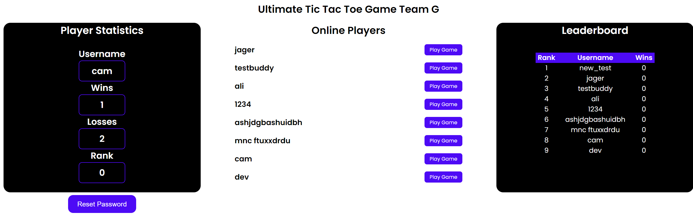

# Team G's Ultimate Tic Tac Toe Game

## Introduction

This is the repository of the COMP 2005 TERM Project for Team G

## Getting Started

These instructions will guide you on how to run the program and unit tests.

### Prerequisites

Before installing the packages, make sure you have the following prerequisites:

* Python 3.x installed on your system
* Internet connection to download the packages

### Installing

To install the required packages, follow these steps:

1. Open a terminal or command prompt.
2. Run the following command to install the `webbrowser` package: ```pip install webbrowser```
3. Run the following command to install the `pytest` package: ```pip install pytest```
4. Run the following command to install the `bottle` package: ```pip install bottle```
5. Run the following command to install the `shelve` package: ```pip install shelve```

Once the installation is complete, you can proceed with running the program and tests as mentioned in the respective sections.

### Running the Program

This script serves as the entry point for running the project's server API.

To run the project, you have two options:

1. Running from the root directory:
    * Open a terminal.
    * Navigate to the root directory of the project.
    * Type `python serverAPI.py` in the terminal and press Enter.

2. Running from the serverAPI.py file:
    * Open the serverAPI.py file in your preferred Python editor.
    * Click the "Run" button or use the corresponding keyboard shortcut to execute the script.

Note: Make sure you have the necessary dependencies installed before running the project.

### Running the Tests

All the unit test files are located in the `tests/` folder.

* tests for `serverAPI.py` are located in `test_api.py` file
* tests for `frontend.py` are located in `test_html.py` file
* tests for `user.py` are located in `test_user.py` file
* tests for `store.py` are located in `test_store.py` file
* tests for `applogic.py` are located in `applogictest.py` file
  
## Game Page Overview

Upon launching the Game , you will be presented with a user-friendly interface that includes the following elements:

* **Current Player**: Displays the username of the player whose turn is currently active.
* **Opponent Username**: Shows the username of the opposing player.
* **Game Board**: The central area where the game takes place.
* **Your Score**: Indicates the number of 3x3 boards you have won.
* **Opponent's Score**: Reflects the number of 3x3 boards won by your opponent.
* **Turn Indicator**: A notification that signals when it's your turn to play.
* **Result**: Displays the outcome of the game once it concludes, like "The Game is a tie!".

Here's a visual representation of the game interface:



## User Dashboard Overview

Upon singing into the application, you will be presented with a user dashboard that includes the following elements:




## Documentation

All documents related to the project are located in the `documents` folder in the repository. The following are some of the key documents:

* SCRUM Meeting Minutes: [docs\MeetingNotes.md](https://github.com/CS2005W24/term-project-teamg/blob/master/docs/MeetingNotes.md)
* Kanban Board: [https://github.com/orgs/CS2005W24/projects/**28**](https://github.com/orgs/CS2005W24/projects/28)
* Issue Tracker: [https://github.com/CS2005W24/term-project-teamg/issues](https://github.com/CS2005W24/term-project-teamg/issues)
* Performance Reviews: [docs\performance_reviews.md](https://github.com/CS2005W24/term-project-teamg/blob/master/docs/performance_reviews/performance_reviews_sprint_2.md)
* Code Reviews: [https://github.com/CS2005W24/term-project-teamg/pulls?q=is%3Apr](https://github.com/CS2005W24/term-project-teamg/pulls?q=is%3Apr) **Note: Code reviews are contained within the Pull Request code review functionality within Github.**
* Code Review Process Documentation(Detailed): [docs\code_review_process.md](https://github.com/CS2005W24/term-project-teamg/blob/master/docs/code_review_process.md)
* Component Architecture Documents: [docs\architecture_docs](https://github.com/CS2005W24/term-project-teamg/tree/master/docs/architecture_docs)
* Process Model Document: [docs/ProjectModelDocument](https://github.com/CS2005W24/term-project-teamg/blob/master/docs/ProcessModelDocument.md)

## Tools

We are using the following GitHub tools for this project:

* Projects: [https://github.com/orgs/CS2005W24/projects/**28**](https://github.com/orgs/CS2005W24/projects/28)
* Issue Tracker: [https://github.com/CS2005W24/term-project-teamg/issues](https://github.com/CS2005W24/term-project-teamg/issues)

No other Software engineering tools were used to coordinate our team and/or progress.

## Sprint 1 Release Status

**Update**: Individual modules are working. There is a need to do some refactoring and adjustments to make everything work for the game.

Working Features: Login Page (Works on the frontend) , Registration Page (Works in the frontend)  
Features in Progress: Backend Login and Registration, Playing a game, Session Management, Show players who are Online, Some Game Logic

## Sprint 2 Release Status

### Working Features

| Feature | Description |
| ------- | ----------- |
| Login | User can login with previously registered credentials and see their dashboard. |
| Registration | User can create an account that persists in the database. |
| Reset Password | User can reset password. |
| Choosing a player to play against | A signed in user can pick someone to play a game with from the list of online users. |
| Leaderboards | The top 10 players by wins are displayed on the user dashboard. |
| List of online players | When a user signs in a list of other online players are displayed to choose someone to play a game with. |
| User Database | User database implemented and persists accross sessions. |
| Playing a game in one browser | two users can play a game of tic tac toe in a single browser.  |
| Filling of a completed sub-board | In the event a sub-board of tic tac toe is won, the app logic correctly fills in the rest of the board with the players shape. |
| Player Win/Loss/Draw scores | Player win/loss/draw scores are updated and maintained in the database, and wins and losses dipslayed on the user dashboard. |
| Game persistance | Application logic and database persist currently unfinished or in progress games. |
| User authentication | User authentication and security implemented with hashing. |

### Uncompleted Features

All uncompleted features outlined in this table are planned to be completed in sprint 3.

| Feature | Description |
| ------- | ----------- |
| User/Player History | advanced player history not yet implemented, not currently storing a list of finished games under the user with the outcomes and opponents  |
| Live Score | Live score of how many boards a player has scored within a currently played game not yet implemented. |
| Live Statistics | live statistics of the game and players not yet implemented |
| Multi-browser game | Multi-browser operating game not yet implemented, use of sockets and/or a refreshing and board-locking mechanism not yet implemented. |
| Profile Editing | Editing of a users profile ie. username, picture etc. not yet implemented. |
| Conditional Refresh | Conditional refresh to synchronize a live played game between users not yet implemented. |
| Resuming incomplete game | Resuming incomplete game not yet implemented, need to gather a list of all active games relevant to a user and display them so that they can be returned to. back-end functionality and game persistance already implemented. |

## Authors

Cameron Selci

Jager Cooper

Mohd Ali Bin Naser

Evan Best

Devender Singh

## Pull Request Deadline

### Sprint 1

March 16th, 11:30pm

### Sprint 2

April 5th, 11:30pm

## Acknowledgments

| Team Member | Source Acknowledgement |
| ----- | ----- |
| Whole Team | *used GenAI to teach us aspects on the requirements of this course, the processes, and overcome the difficulties we have faced with the framework required for the course* |
| Cameron Selci |  Created and wrote tests for app logic. |
| Jager Cooper | Created and wrote tests for server API. |
| Mohd Ali Bin Naser | Created and wrote tests for frontend. |
| Evan Best | Created and wrote tests for persistent storage. |
| Devender Singh | Created and wrote tests for user management system. |
