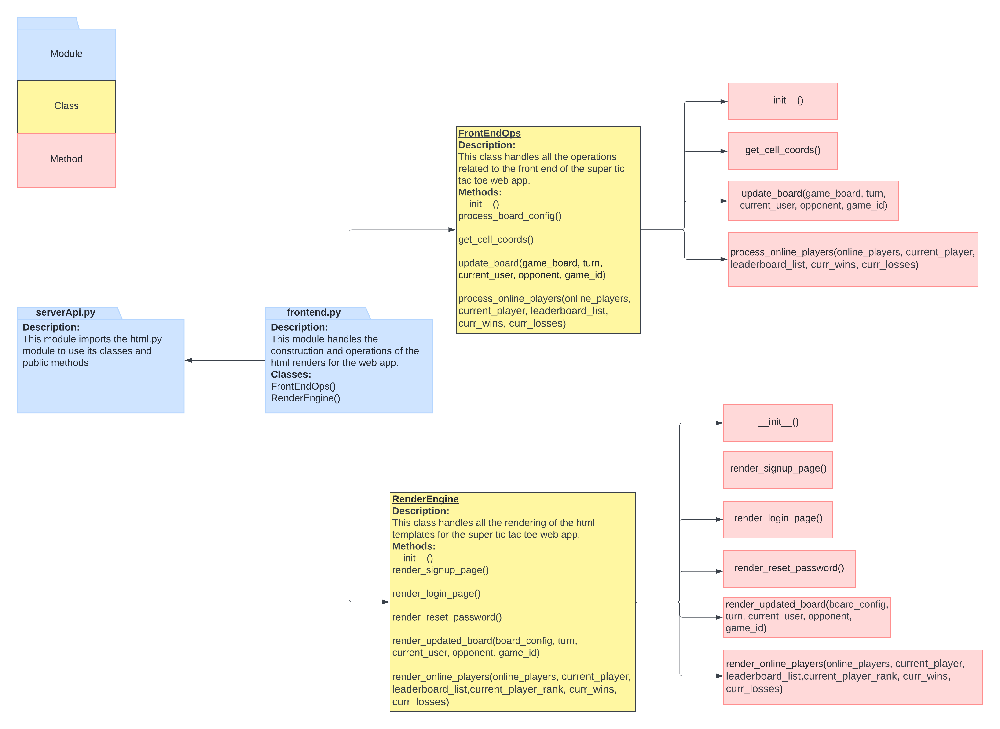

# HTML (Frontend) Architecture Documentation
**Created by:** Mohd Ali Bin Naser

This file contains a brief description about the architecture of the HTML frontend that'll be used in the web app.

### Library/Module Imports:
---

- `template from bottle`: To generate dynamic HTML content with the combination of static HTML templates with dynamic data.
- `os`: To locate the paths of the HTML templates.

 

### Classes:
---
#### `FrondEndOps()`
- **Description:**
  - This class handles the operations/processing related to the front end of the super tic tac toe web app.
- **Attributes:**
  - `self.AppRenderEngine`: Instance of the RenderEngine() class used for processing data to and from the frontend dynamically.
- **Methods:**
  - `__init__(self)`:
  - `process_board_config(self, game_board)`:
  - `get_cell_coords(self, cell_id)`:
  - `update_board(self, game_board)`:

#### `RenderEngine()`
- **Description:**
  - This class handles the rendering of the html templates for the super tic tac toe web app.
- **Attributes:**
  - `self.signup_page`: The HTML template for the user signup/registration page.
  - `self.login_page`: The HTML template for the user login page.
  - `self.main_game_page`: The HTML template for the game/home page.
- **Methods:**
  - `__init__(self)`:
  - `render_signup_page(self)`:
  - `render_login_page(self)`:
  - `render_main_game_page(self, board_config)`:
  - `render_updated_board(self, board_config)`:

 

### Unit Testing:
---
**Location:** `tests/test_html.py`

#### Testing Classes:
#### `TestFrontEndOps()`
- **Description:** Tests the operations/processing related to the front end of the super tic tac toe web app.

#### `TestRenderEngine()`
- **Description:** Tests the rendering of the html templates for the super tic tac toe web app.

Each class has 2 units tests for each method in `FrontEndOps()` and `RenderEngine()` classes from `html.py`. One unit test for the method and another for the method's exception handling.

 

### HTML Architecture UML Diagram:
---

