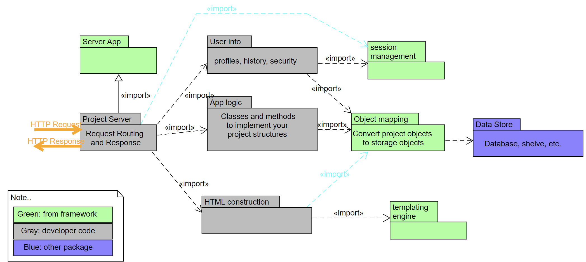

# Project Description

This project is a two-player game server for the game "Super Tic Tac Toe" or "Ultimate Tic Tac Toe". The server is implemented in Python using the Bottle web framework for URL endpoint routing.

The server provides a range of features including, but not limited to, player registration, game initiation, player addition, game login, move execution, move verification, game termination, and game persistence across sessions.

## Planned Features

1. Player registration
2. Adding players to a game
3. Starting up a new game
4. Logging into your account
5. Making a move in a game
6. Checking if the other player has moved
7. Determining the end of a game
8. Persisting games between user sessions

- Possible additonal features:
   1. Leaderboard
   2. Player performance rating
   3. 2-Player LAN games with multi-user sign in
   4. Players game history
   5. Friend list
   6. In game messaging

## Component Architecture

## Detailed Documents for Each Main Architectural Component

1. [Server API](../docs/arch_serverAPI.md)
2. [Application Logic](../docs/arch_applogic.md)
3. [Data Store](../docs/arch_store.md)
4. [HTML Templates](../docs/arch_html.md)
5. [User Management](../docs/arch_user.md)
