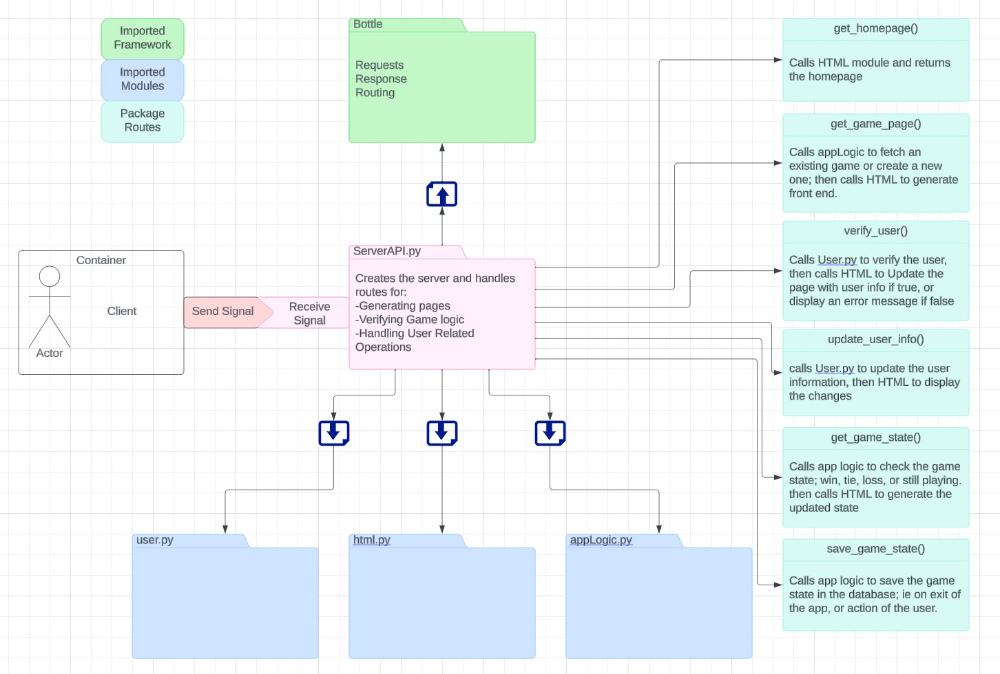

# Server API Documentation

This document provides a brief overview of the server API, which is implemented using the Bottle web framework in Python.

## Imports

The following modules are imported:

- `webbrowser`: To open the web browser.
- `bottle`: To create the web server and handle HTTP requests and responses.

## Bottle App

A Bottle app is created to handle the routes and server responses.

## Routes

The server has several routes to handle different requests:

- `/`: This route returns the homepage of the server. It responds with a string "Hello World!".

- `/game/<game_id>`: This route is intended to return the game's page, if the game id doesnt exist in the database, creates a new game. The function is currently not implemented.

- `/user`: This route is intended to verify the user sign in information. The function is currently not implemented.

- `/update_user/<user_id>`: This route is intended to update the user information if the user exists or creates a new user if the user does not exist. The function is currently not implemented.

- `/check_game/<game_id>`: This route is intended to return the game state of the given ID in a 9x9 Matrix. The function is currently not implemented.

- `/save_game/<game_id>`: This route is intended to update the game state of the given ID. The function is currently not implemented.

## Server Start

The server is started on `localhost` with port `8080`. After the server starts, the web browser is opened with the server's URL.

## Server API Diagram

