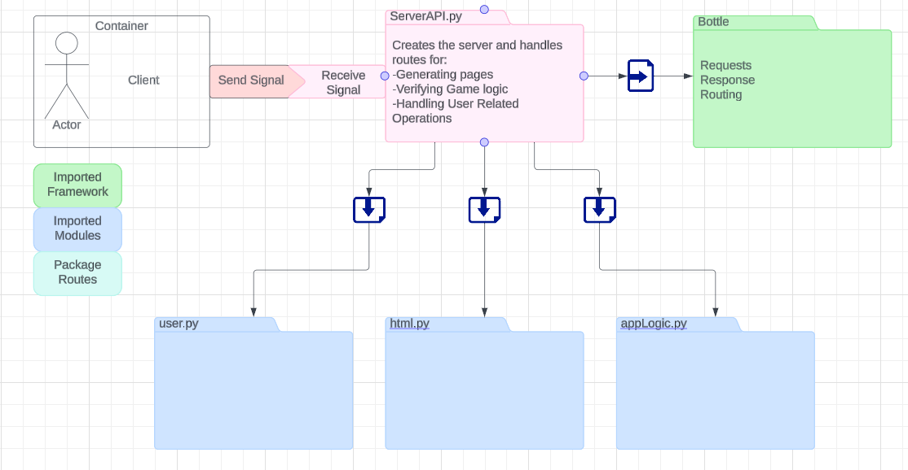

# Server API Documentation

Created by: Jager Cooper

This document provides an overview of the server API implemented using the Bottle web framework in Python.

## Imports

The following modules are imported:

- `webbrowser`: To open the web browser.
- `frontend`: To handle rendering and updating the front-end UI.
- `applogic`: To manage game state and logic.
- `user`: To handle user authentication and registration.
- `Bottle`: To create the web server and handle HTTP requests and responses.

## Bottle App

A Bottle app is created to handle the routes and server responses.

## Routes

### Static Files

- `/static/<filename>`:
  - Description: Returns static files from the server.
  - Method: GET
  - Parameters: filename (String) - Name of the static file.
  - Response: String - The requested static file.

### Home Page

- `/`:
  - Description: Redirects to the login page.
  - Method: GET
  - Response: Redirect to /login.

### Game Page

- `/game/<game_id>`:
  - Description: Returns the game's page or creates a new game if the ID doesn't exist.
  - Method: GET
  - Parameters: game_id (String) - ID of the game.
  - Response: String - The game's page or "Game Not Found" (404).

### User Authentication

- `/login`:
  - Description: Handles user sign-in information verification.
  - Method: GET (to retrieve login page), POST (to process login data)
  - Response: String - The login page or "User not found" (404) for unsuccessful login.

- `/update_user`:
  - Description: Updates user information if the user exists or creates a new user.
  - Method: POST
  - Parameters: username (String) - Username of the user to update.
  - Response: Int - 200 for successful update, 404 for user not found.

### User Registration

- `/register_user`:
  - Description: Registers a new user to the server.
  - Method: GET (to retrieve registration page), POST (to process registration data)
  - Response: String - The registration page or "User already exists" (400) for existing user.

### Game Management

- `/create_game/<user_id1>/<user_id2>`:
  - Description: Creates a new game and returns the game's page.
  - Method: POST
  - Parameters: user_id1, user_id2 (Strings) - IDs of the users involved in the game.
  - Response: String - The game's page.

- `/check_game`:
  - Description: Checks the game state for a given ID and updates the frontend.
  - Method: POST
  - Response: String - Updated board state or "Invalid Move" (400) for invalid move.

- `/save_game/<game_id>`:
  - Description: Updates the game state for a given ID.
  - Method: POST
  - Parameters: game_id (String) - ID of the game.
  - Response: Int - 200 for successful update, 400 for error.

- `/load_game/<game_id>`:
  - Description: Loads the game state for a given ID.
  - Method: GET
  - Parameters: game_id (String) - ID of the game.
  - Response: String - Game state in a matrix or "Game Not Found" (404).

## Server Start

The server is started on localhost with port 8080. After the server starts, the web browser is opened with the server's URL.

## Server API Diagram

