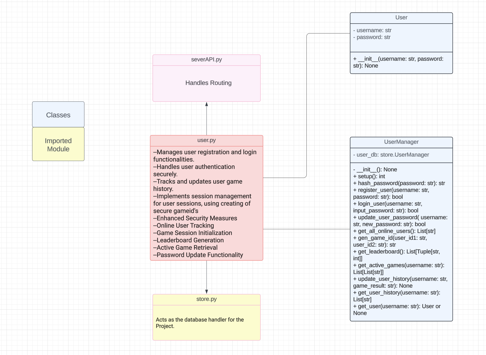

# User Architecture Documentation
**Created by:** Devender Singh

## Introduction
This document provides a comprehensive overview of the User Management System architecture in our application. It focuses on user-related operations such as registration, authentication, password management, and activity tracking, reflecting the latest changes and enhancements.

## Components

### User Database
- **Purpose:** Securely stores user information, including usernames and encrypted passwords, to ensure data confidentiality and integrity.
- **Implementation:** Utilizes `shelve` for persistent storage, offering an efficient and straightforward method for data retrieval and manipulation.

### Security Module
- **Purpose:** Manages the encryption of user passwords to enhance the security of stored credentials.
- **Implementation:** Employs the `hashlib` module for SHA-256 hashing, providing strong and secure encryption for password storage.

### Unique Identifier Generator
- **Purpose:** Generates unique identifiers for game sessions, aiding in the management and differentiation of user sessions and activities.
- **Implementation:** Uses the `uuid` module to produce unique IDs for games, ensuring session identifiers are unique and non-replicable.

## Classes

### User Class
- **Responsibilities:** Represents user entities with essential attributes like username and password.
- **Methods and Attributes:**
  - `__init__(self, username, password)`: Constructor that initializes a new User instance.
  - `username (str)`: A unique identifier for the user.
  - `password (str)`: The user's password, stored in encrypted format.

### UserManager Class
- **Responsibilities:** Handles various user operations such as registration, login, and managing user history.
- **Key Methods:**
  - `setup(self)`: Sets up the user database for data storage and retrieval.
  - `hash_password(self, password)`: Encrypts a password using SHA-256.
  - `register_user(self, username, password)`: Registers a new user, encrypting the password for storage.
  - `login_user(self, username, input_password)`: Authenticates a user by comparing encrypted passwords.
  - `update_user_password(self, username, new_password)`: Updates a user's password after encrypting the new password.
  - `get_all_online_users(self)`: Lists all users marked as online.
  - `gen_game_id(self, user_id1, user_id2)`: Generates a unique ID for a new game session between two users.

## Implementation Details

### User Registration
- Uses `register_user` to add users with encrypted passwords, enhancing security by avoiding plaintext password storage.

### User Authentication
- `login_user` authenticates users by encrypting the input password and comparing it with the stored version, maintaining secure authentication practices.

### Password Management
- Enables users to securely change their passwords through `update_user_password`, which encrypts the new password before updating the stored version.

### Activity and Session Management
- Tracks user game results and manages active game sessions, using methods like `update_user_history` and `get_active_games`, to maintain comprehensive user activity records.

### Game Session Initialization
- `gen_game_id` creates unique game IDs for new sessions, using UUIDs to ensure each session is distinct and properly initialized in the database.

## Key Functionalities

- **Secure Registration and Authentication:** Ensures password security through SHA-256 encryption during user registration and authentication.
- **Game Session Management:** Facilitates unique game session identification and management, promoting effective game session tracking.
- **Enhanced Password Security:** Supports secure password updates by encrypting new passwords before storage.

## Future Directions

- **Enhanced Security Features:** Plans to introduce two-factor authentication and other security enhancements.
- **User Activity Analytics:** Aims to extend functionality to analyze user activity patterns for improved engagement and system optimization.
### User Activity Analytics
- Extending the system to capture and analyze user activity patterns for improved user engagement and system optimization.

## User Management System UML Diagram

